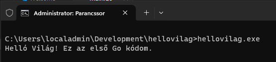

# Go - Helló Világ

## Előfeltételek

Az alábbi helyen megtalálod az előkészületeket a Go-ban való fejlesztéshez: https://github.com/cloudsteak/golang-basics

## Projekt létrehozás

1. Nyiss egy parancssort (CMD)
2. Navigálj abba a mappába ahol a kódod fogod tárolni a helyi gépeden.
3. Hozd létre a projekted mappáját. Pl.: `hellovilag`

```bash
mkdir hellovilag
```

4. Lépj be a mappába

```bash
cd hellovilag
```

5. Készítsd el a projekted alap struktúráját

```bash
go mod init hellovilag
```

6. indítsd el innen a Visual Studio Code-ot.

```bash
code .
```

## Go alkalmazás

1. Hozd létre a `main.go` fájlt a project gyökerében
2. A szerkesztőben a `main.go` fülön, ked el gépelni: `package`
3. A VS Code felajánl több lehetőséget is. Nekünk jelnleg a `package main` szükséges
4. Ez alá a sor alá pedig illeszd. be az alábbi fő függvényt:

```go
func main() {
    fmt.Println("Helló Világ! Ez az első Go kódom.")
}
```

5. Mentsd el a módosításokat

6. A Go érzékeli, hogy van `fmt` csomag függőség és pár másodperc múlva módosítja is a kódot ennek megfeleően.

```go
package main

import "fmt"

func main() {
	fmt.Println("Helló Világ! Ez az első Go kódom.")
}
```

Megjegyzés: Nem minden csomagot tud automatikusan telepíteni a Go. Tehát van amit majd külön parancsok futtatásával kell telepítneni.


## Alkalmazás futtatása

A megírt kódot az alábbi paranccsal tudjuk futtani a project fő mappájából: `go run .` vagy `go run main.go`

## Alkalmazás fordítása (build)

Ha szeretnénk az alkalmazásunkat máshol is futtatni, anélkül, hogy minden fejlesztői eszközt és függőséget telepíyteni kellene, akkor azt egy csomagba le is tudjuk fordítani (buld). Ehhez az alábbi parancsot kell futtatni: `go build`

Eredményképpen Windows-on egy exe fájlt kapunk, amit futtathatunk a Go fejlesztői környezewten kívül is.



